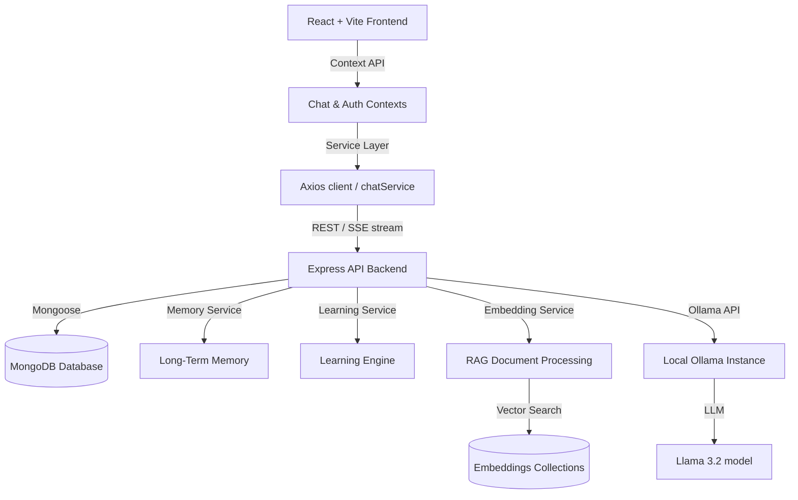

# Aether AI — Local AI Assistant (Completely Private)

Aether AI is a premium, dark-themed, local-first artificial intelligence assistant. Designed for absolute privacy, it runs entirely on your local machine using **Ollama**, **Llama 3.2**, and a **Node.js/Express + MongoDB** stack. It features **RAG (Retrieval-Augmented Generation)**, **Long-Term Memory**, **Continuous Learning**, and real-time **Token-by-Token Streaming**.

---

## 🏗️ Application Architecture



---

## 🛠️ Tech Stack

- **Frontend**: React, Vite, Context API, React Router, Framer Motion, CSS Modules, React Icons, React Toastify.
- **Backend**: Node.js, Express.js, Mongoose, JWT Authentication, Multer, Helmet, CORS, PDFParse, Mammoth.
- **AI Core**: Ollama (Llama 3.2 model for chat & nomic-embed-text for vector embeddings).

---

## ⚙️ Environment Variables

### Backend Configuration (`server/.env`)
Create a `server/.env` file with the following variables:
```env
PORT=5002
MONGODB_URI=mongodb://127.0.0.1:27017/aetherai
JWT_SECRET=YourSuperSecretPasswordTokenKey
OLLAMA_URL=http://127.0.0.1:11434
MODEL=llama3.2:latest
EMBEDDING_MODEL=nomic-embed-text
CLIENT_URL=http://localhost:5173
NODE_ENV=production
```

### Frontend Configuration (`client/.env`)
Create a `client/.env` file if you need to override the default backend URL:
```env
VITE_API_URL=http://localhost:5002/api/v1
```

---

## 🚀 Installation & Local Setup

### Prerequisites
1. Install [Node.js](https://nodejs.org/) (v18+ recommended).
2. Install [MongoDB Community Server](https://www.mongodb.com/try/download/community) and verify it is running locally on port `27017`.
3. Install [Ollama](https://ollama.com/) and run the models:
   ```bash
   ollama pull llama3.2:latest
   ollama pull nomic-embed-text:latest
   ```

### Backend Setup
1. Navigate to the server folder:
   ```bash
   cd server
   ```
2. Install dependencies:
   ```bash
   npm install
   ```
3. Start the server in development mode:
   ```bash
   npm run dev
   ```

### Frontend Setup
1. Navigate to the client folder:
   ```bash
   cd ../client
   ```
2. Install dependencies:
   ```bash
   npm install
   ```
3. Start the client dev server:
   ```bash
   npm run dev
   ```
4. Access the web interface in your browser at `http://localhost:5173` (or `http://localhost:5174`).

---

## 📂 Project Directory Structure

```
Aether AI/
├── client/                     # Frontend Application
│   ├── src/
│   │   ├── animations/         # Framer Motion config
│   │   ├── components/         # Reusable layouts, AuthCard, Chat, etc.
│   │   ├── context/            # AuthContext, ChatContext (Single Source of Truth)
│   │   ├── hooks/              # Custom React hooks (useChat, useAuth)
│   │   ├── pages/              # Lazy-loaded views (Home, Chat, Profile, etc.)
│   │   ├── services/           # API handlers (api.js, chat.service.js)
│   │   └── styles/             # CSS Variables & global resets
│   └── index.html
├── server/                     # Backend API Server
│   ├── config/                 # DB, Express and Env setup
│   ├── controllers/            # Auth, Chat, Document, and Memory controllers
│   ├── middleware/             # JWT Auth, Upload, notFound, and error handlers
│   ├── models/                 # Mongoose schemas (User, Chat, Document, etc.)
│   ├── routes/                 # Express REST endpoint maps
│   ├── services/               # AI context compilers, embedding, and RAG logic
│   └── server.js
└── README.md
```

---

## 📡 API Documentation

### 🔐 Authentication

#### Register User
`POST /api/v1/auth/register`
- **Body**: `{ "name": "User", "email": "user@example.com", "password": "securepassword" }`
- **Response**: `201 Created` on success.

#### Login User
`POST /api/v1/auth/login`
- **Body**: `{ "email": "user@example.com", "password": "securepassword" }`
- **Response**: `200 OK` returning JWT token and user info.

---

### 💬 Chat Management

#### Get All Chats
`GET /api/v1/chat`
- **Headers**: `Authorization: Bearer <token>`
- **Response**: `200 OK` returning chat arrays.

#### Create New Chat
`POST /api/v1/chat`
- **Headers**: `Authorization: Bearer <token>`
- **Response**: `201 Created` containing a blank conversation.

#### Stream Chat Message (Server-Sent Events)
`POST /api/v1/chat/:id/stream`
- **Headers**: `Authorization: Bearer <token>`, `Accept: text/event-stream`
- **Body**: `{ "message": "Your prompt here" }`
- **Response**: Server-Sent Events stream:
  - `data: {"type":"token","token":"..."}`
  - `data: {"type":"done"}`

#### Delete Chat
`DELETE /api/v1/chat/:id`
- **Headers**: `Authorization: Bearer <token>`
- **Response**: `200 OK`.

---

### 📁 Document Upload & RAG

#### Upload Document
`POST /api/v1/documents`
- **Headers**: `Authorization: Bearer <token>`, `Content-Type: multipart/form-data`
- **Body**: FormData containing `"document"` file parameter.
- **Rules**: Limit 20 MB. Supported types: `txt`, `md`, `pdf`, `docx`.

---

## 🔍 Troubleshooting Guide

### 1. Ollama Connection Error
- **Symptom**: Chat streams return error logs, or dashboard reports Ollama as "Unavailable".
- **Resolution**: Open a terminal and check if Ollama is running (`curl http://localhost:11434`). If not, launch the Ollama application. Make sure the Llama 3.2 model is downloaded (`ollama pull llama3.2`).

### 2. Document Processing Hangs or Fails
- **Symptom**: Document status says "failed", or text chunks are missing in vector searches.
- **Resolution**: Ensure the document size is under 20 MB and matches the supported mime types (TXT, MD, PDF, DOCX). Check your MongoDB connection.

### 3. Session Expired or Redirect Loops
- **Symptom**: Client redirects repeatedly to `/login`.
- **Resolution**: Clear local storage in browser devtools, restart your Node server, and log in again. Ensure the `JWT_SECRET` in `server/.env` is consistent.
